# Running a recruitment cycle

For whoever is running applications this semester. You do not need to have used
this tool before, and you do not need to know anything about how it works.

Everything below is one full cycle, in order, from the application export to the
final list of new Sparklets.

**Practise first.** There is a training file, `prisma/fixtures/demo-cycle.csv`,
with 25 invented applicants in it. Import it as its own cycle and click all the
way through. Nothing in it is real, so nothing you do to it matters. This guide's
screenshots come from exactly that file, so what you see should match.

There is also a finished cycle called **Demo Cycle (finished — for reference)**.
When a screen does not look the way you expect, open that one to see what it
looks like when it is done.

---

## Before you start

You need two things from whoever ran it last:

- **The app password.** Gets you into the tool at all.
- Nothing else. You will create this cycle's own password yourself, in step 1.

Sign in at `/login`. It asks for your **first and last name** as well as the
password.

> **Your name is not a password and is not checked.** Anyone with the app
> password can type anything. It is there so that when someone changes a score
> or reverses a decision, the record says who — the whole club shares one
> password, so without a name every change reads as "an admin". Type your real
> name.

---

## 1. Create the cycle and upload the file

**Instances → New instance.**

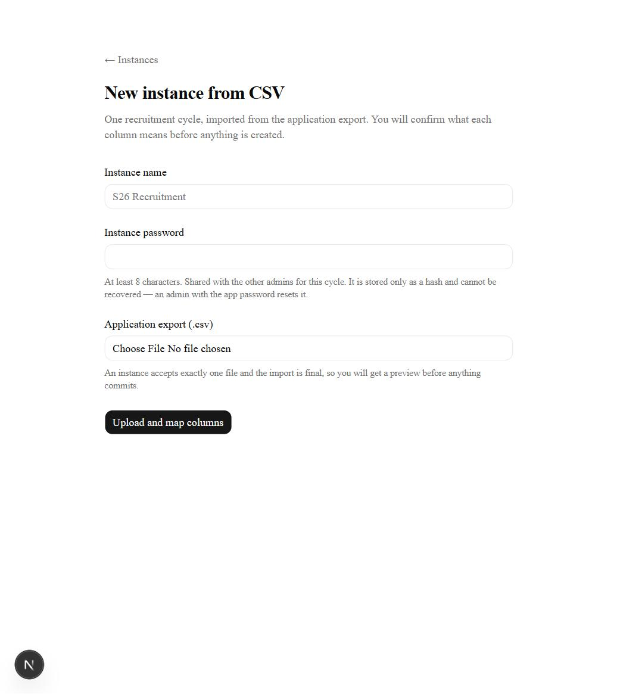

Three things:

- **Instance name** — how this cycle appears in the list. "F26 Recruitment" or
  similar.
- **Instance password** — you are choosing this now, and it is separate from the
  app password. Share it with the other admins on this cycle. **It cannot be
  recovered.** If everyone forgets it, an admin with the app password can reset
  it from Settings, but nobody can read it back.
- **The application export**, as a `.csv`.

> **A cycle accepts exactly one file, and importing is final.** If the file turns
> out to be wrong, the fix is to delete the whole cycle and start again — which
> is quick, as long as you notice before people start scoring. That is what the
> next two steps are for.

---

## 2. Say what each column means

Nothing has been created yet. This screen is you telling the tool how to read the
file, and you can change anything on it until you commit.

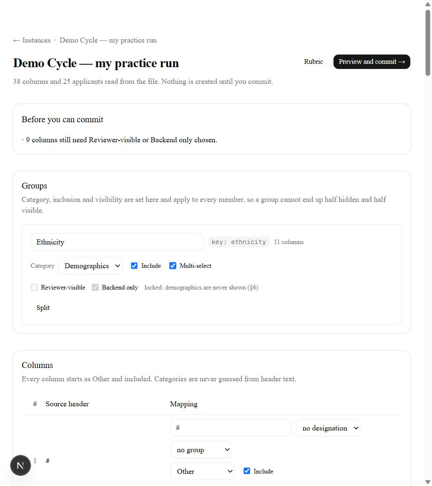

The banner at the top lists what still needs doing before you can continue. Work
down it.

### Detected groups

Some questions arrive as several columns rather than one. Ethnicity is the usual
case: ten separate columns, any number of which an applicant may tick.

The tool notices columns that look like one question and offers them as a
**group**. This is a suggestion, not a decision — nothing is stored until you
name it.

**Name it `Ethnicity` and press Create group.** Ten columns become one question,
which is what makes the demographic breakdowns later add up to the number of
people rather than the number of boxes ticked.

> If you see **more than one** group offered where you expected one — say, three
> separate clusters of ethnicity columns — that means some of those columns are
> empty for every applicant in the file. An empty column has nothing to
> recognise. It is usually harmless in a real export, where every option gets
> ticked by somebody.

### The write-in column

Ethnicity usually has a free-text "specify your own" column beside the ten. **The
tool will not find this one for you** — its values are different for every
person, so there is nothing to recognise.

Add it by hand: find that column in the table below, set its **group** to
`Ethnicity`, then set its role to **write-in (not counted)**.

> That last part matters. Left as "option (counted)", one person's typed answer
> becomes its own category in every breakdown for the rest of the cycle.

### The group's settings

Set **Category** to `Demographics`. The visibility checkboxes beside it will
lock themselves to **Backend only**, greyed out, reading *"locked: demographics
are never shown (§6)"* — that is the tool enforcing the club's own rule that
reviewers do not see ethnicity. You cannot turn it off, and that is deliberate:
the rule is the system's job, not something you have to remember.

> This applies to **all three rounds**, including second-round deliberation.
> Ethnicity is an admin statistic — you see it on the results and composition
> screens — and it never reaches a reviewer.

Category, inclusion and visibility are set on the *group* and apply to all
eleven columns, so a group cannot end up half hidden and half visible.

### The two required designations

Further down, in the columns table:

- **Email Address** → designation **Email column**. This is how later imports
  find the right person, so it is not optional.
- **First Name** and **Last Name** → designation **Name column** (both of them).

### Categories

Every column starts as **Other**. The tool never guesses from the header text —
guessing is how a demographic column ends up visible to reviewers.

**Set every essay question to `Responses`.** These are what reviewers read.

Leave the administrative columns (timestamps, response type, network ID) as
Other.

Category says what a column *is*. It no longer says who sees it — that is the
next section, and it is a separate decision.

### Who sees each column

Every column has two checkboxes: **Reviewer-visible** and **Backend only**. They
are mutually exclusive, and **neither is ticked to begin with**. There is no
default and the tool will not pick one for you, because the wrong silent default
is either an empty round or a leak.

- **Reviewer-visible** — every reviewer sees it, in all three rounds.
- **Backend only** — no reviewer sees it, in any round. You still see it.

Work down the table and answer for each column. A column you have not answered
shows **not set** in amber, and the banner at the top counts them.

> **You cannot commit until every column has an answer.** This is a hard stop,
> not a warning. Demographic columns and excluded columns are not counted —
> their answer is already decided for them.

What to tick, in practice: **the essays Reviewer-visible**, the administrative
columns (timestamps, network ID, tags) **Backend only**. The judgement calls are
things like major, minor and graduation year — reviewers can see them if the
club wants that, and it is a one-click change later if you get it wrong.

> **The essays are the one answer the tool argues with.** If you mark a column
> `Responses` and then set it Backend only, the commit is refused. Marking
> something a Response is saying it is what reviewers read, so hiding it is
> almost always a mis-click. If you genuinely want it hidden, change its
> category or un-include it.

---

## 3. Check the preview, then commit

**Preview and commit →**

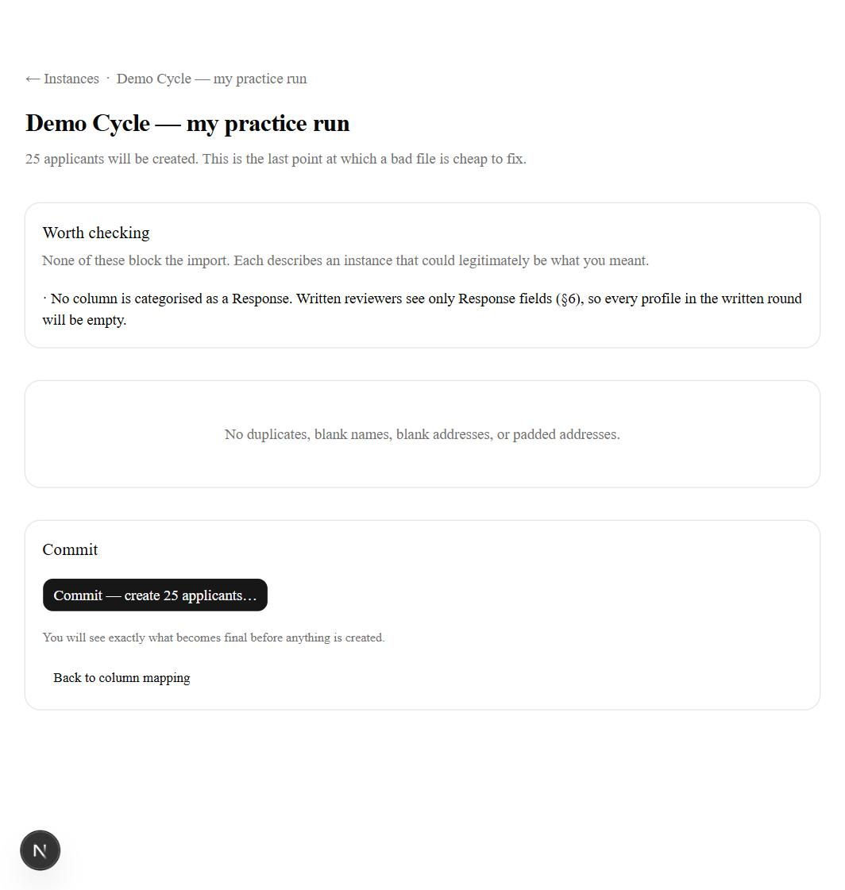

This is the last point at which a bad file is cheap to fix. Three kinds of thing
appear here.

**Things that stop you committing.** The two most common come straight from step
2:

> *3 columns have no visibility set. Choose Reviewer-visible or Backend only for
> each on the columns screen.*

> *2 Response columns are set to Backend only. Reviewers would not see the
> essays.*

Both mean going back to step 2 and finishing the table. Neither can be dismissed
— that is the point of them. The count tells you how many are left.

**Worth checking** — things that are probably wrong but might be deliberate.
These do not block you:

> *No column is categorised as a Response. Nothing marks the essays, so reviewer
> profiles will show only whatever Other columns you set to Reviewer-visible.*

That one is a warning rather than a stop, because an application built entirely
from short-answer Other columns is unusual but not wrong.

**Problems in the file itself** — two applicants sharing an email address, a
blank name, an address with spaces around it. Each is listed with the rows
involved, and you resolve them here. A clean file says so:

> *No duplicates, blank names, blank addresses, or padded addresses.*

When both sections are clear, press **Commit**. Applicants are created and the
column mapping is fixed from here on.

> Some things stay editable after committing: whether a column is included, and
> whether reviewers can see it. What a column *means* — its category, its group,
> its name — does not.

Committing takes you through one more screen that spells out exactly what becomes
permanent. Read it rather than clicking past it.

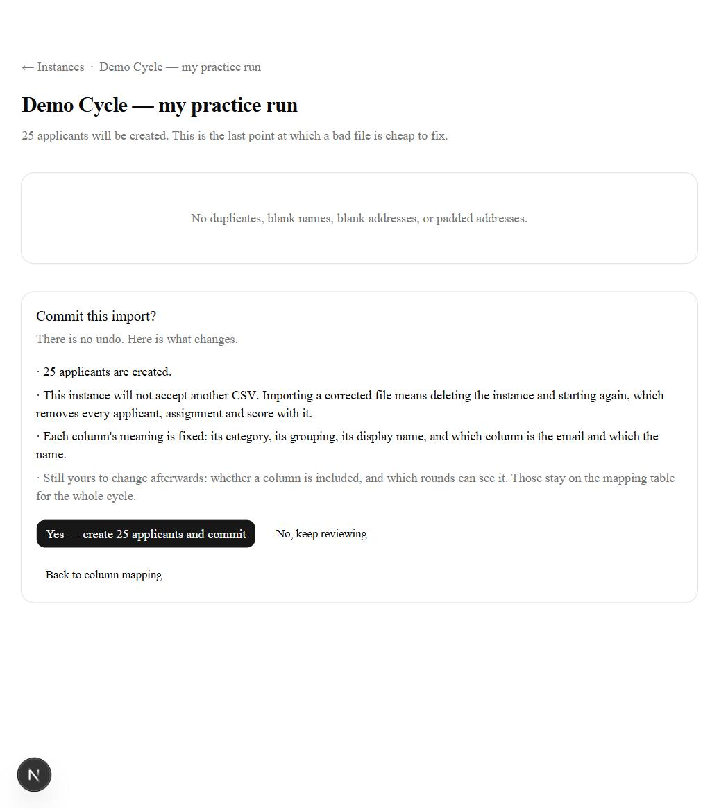

---

## 4. Build the scoring rubric

**Rubric**, from the cycle's page.

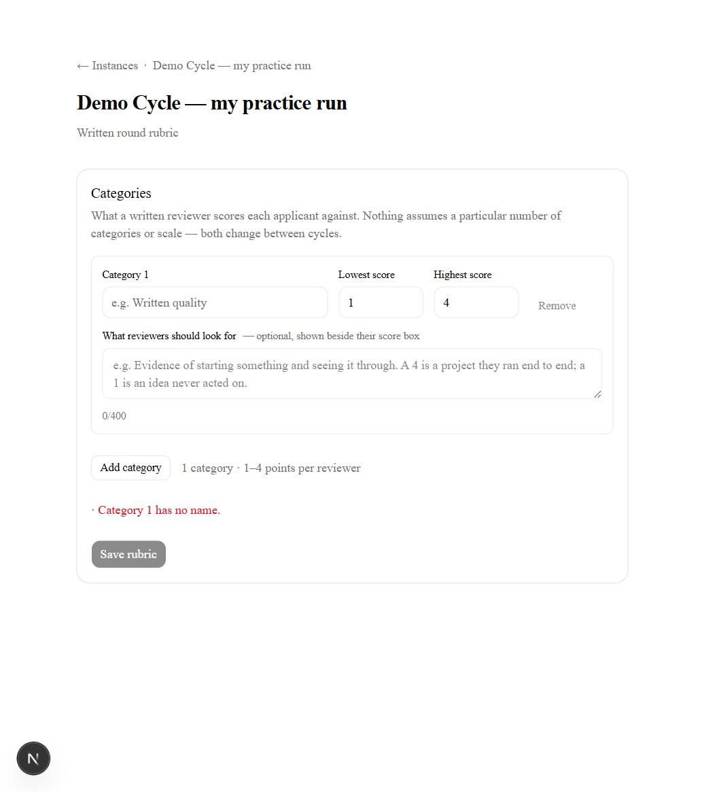

This is what a written reviewer scores each applicant against. Nothing assumes a
particular number of categories or a particular scale — both change between
cycles, and both are yours to set.

For each category: a **name**, a **lowest** and **highest** score, and optionally
a line saying **what reviewers should look for**. Write that last one. It appears
beside the reviewer's score box, and it is the difference between thirty people
scoring the same thing and thirty people scoring thirty things.

> Once anyone has scored an applicant, the rubric locks. You cannot add a
> category halfway through a round and leave the earlier scores meaning something
> different from the later ones.

---

## 5. Add the reviewers

**Reviewers.** Three tabs across the top, one per round — a person can be on any
combination, and the rounds have separate rosters on purpose.

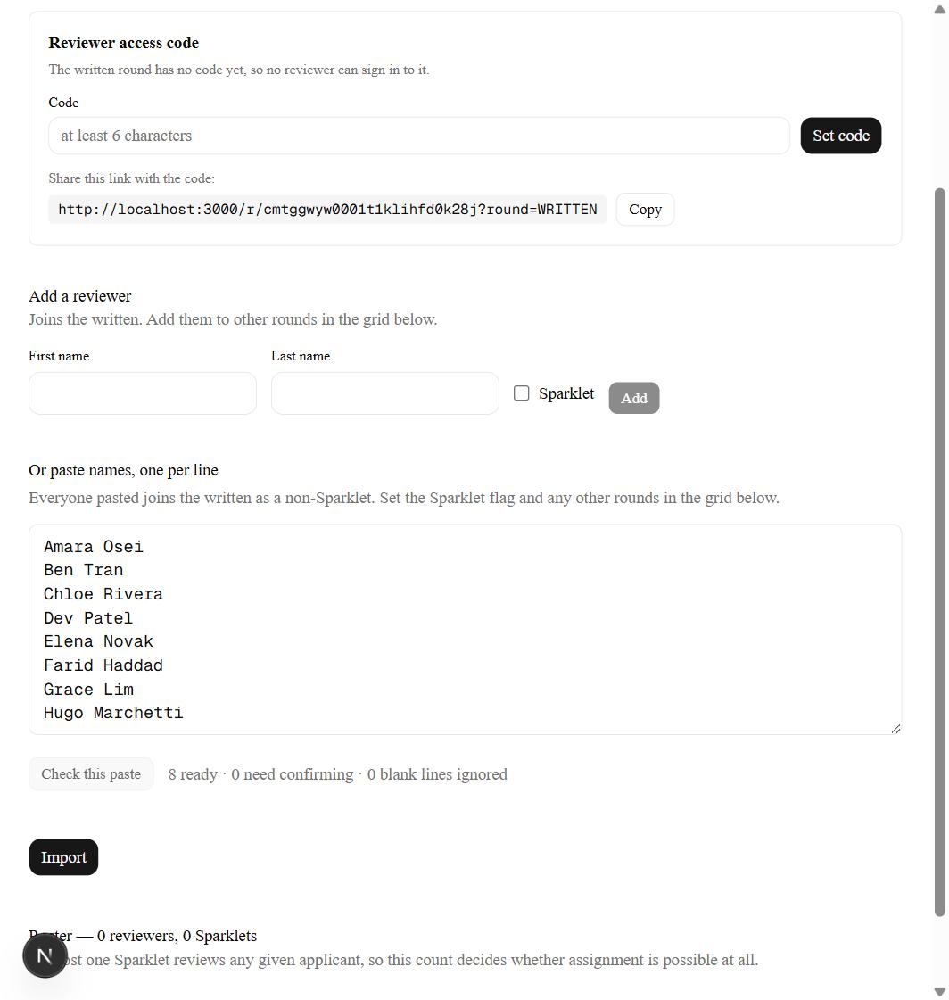

**Paste the names**, one per line, straight from the Slack thread or the sign-up
sheet. Press *Check this paste* first: it tells you how many are ready, how many
need confirming, and how many blank lines it ignored, before anything is created.

It splits each line at the **last space**, so "Mary Anne Chen" becomes Mary Anne
/ Chen. Anything it cannot split, and anything matching someone already on the
roster, is held back for you to confirm rather than guessed at — re-pasting the
same Slack message is the likeliest accident, and it will not silently create
everyone twice.

### Sparklets

Tick **Sparklet** for existing Spark SC members. This matters more than it looks:
**at most one Sparklet reviews any given applicant**, so this count decides
whether assignment is possible at all. The roster summary shows it.

### The access code

Each round has its own code, and reviewers need it to sign in. Set one, then send
**the link and the code together** — the link alone is not enough, and the code
alone is useless.

---

## 6. Assign applicants to reviewers

**Assignments.**

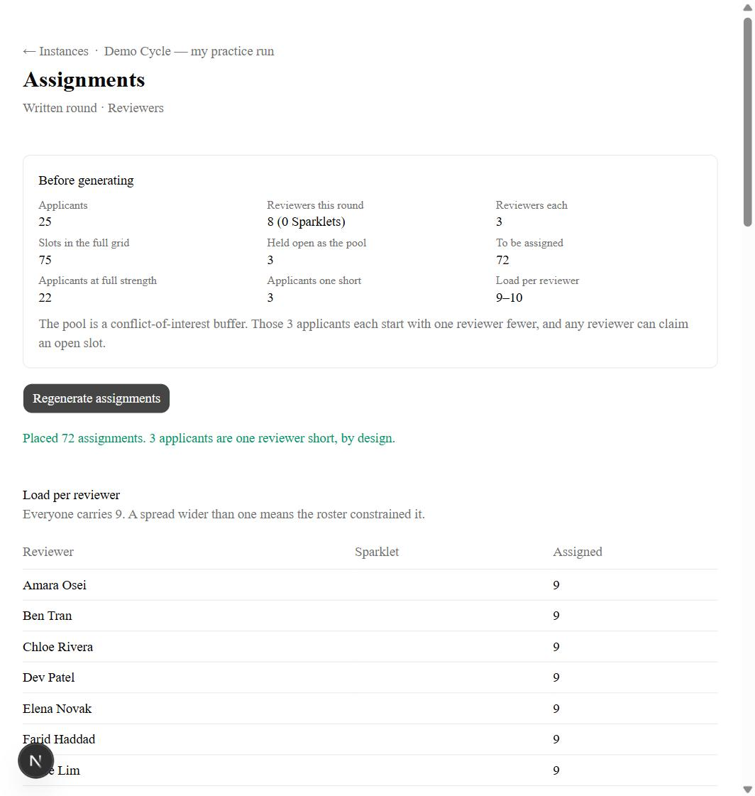

The panel at the top is the arithmetic, before you commit to anything:

| | |
|---|---|
| **Slots in the full grid** | applicants × reviewers each |
| **Held open as the pool** | about 5% of slots, kept free |
| **Applicants at full strength** / **one short** | how the pool is spread |
| **Load per reviewer** | a spread wider than one means the roster constrained it |

Press **Generate assignments**. In the practice cycle that reads:

> *Placed 72 assignments. 3 applicants are one reviewer short, by design.*

### Why some applicants are one reviewer short

The pool is a **conflict-of-interest buffer**, not an oversight. A reviewer who
knows an applicant returns that slot, and any other reviewer can claim an open
one. Spreading the gap across several applicants — each starting with one
reviewer fewer — means a slow-moving pool costs an applicant *one* opinion rather
than all three, which is what would happen if whole applicants were held back
unassigned.

### If it refuses to generate

It will tell you why, and it is almost always the Sparklet rule: too many
Sparklets on the roster for every applicant to get at most one. Add non-Sparklet
reviewers, or take some off this round.

### Changing an assignment by hand

You can assign, unassign or swap any individual pairing, and each change is
recorded with your name against it. **Regenerating keeps manual changes** — it
works around them rather than discarding them — but it will tell you how many it
is carrying before you confirm.

---

## The cycle's home page

Every screen from here is reached from the cycle's own page, and it doubles as a
progress report — each row says where that piece stands.

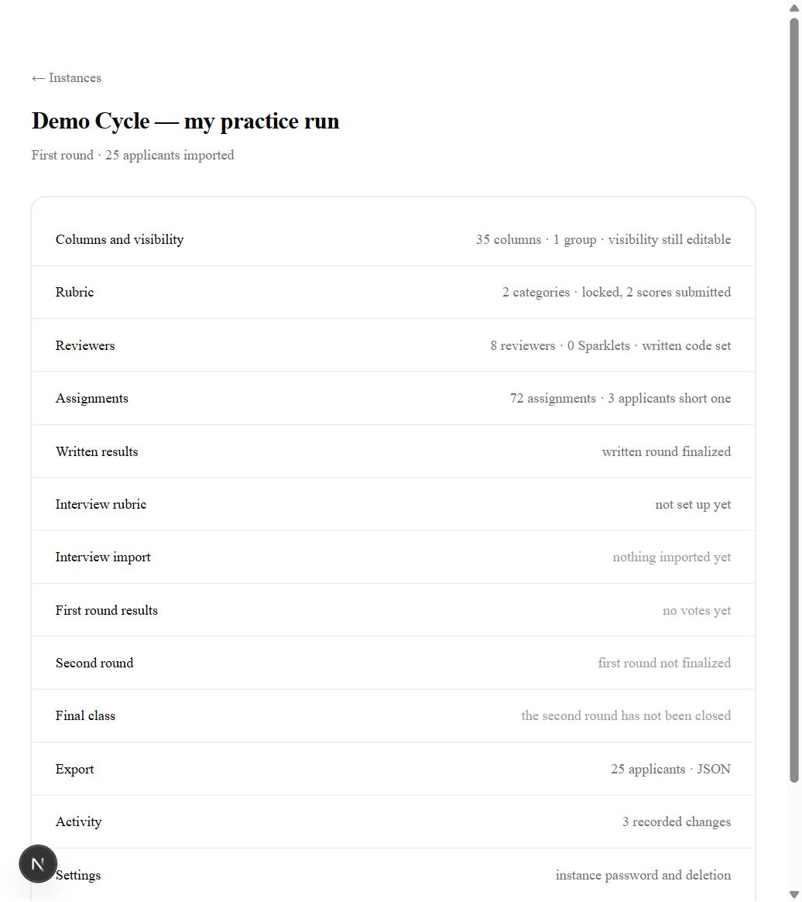

Rows greyed out are waiting on something earlier. They are in roughly the order a
cycle uses them.

---

## 7. The written round

Reviewers do this part. You send them the link and the code, and watch.

### What a reviewer sees

**Not the applicant's name.** Written reviewers see "Applicant 11" and whatever
you marked Reviewer-visible in step 2 — the essays, and anything else you ticked.
Not the name, not the email, and never ethnicity. That is deliberate and it is
enforced by the tool, not by people remembering.

The name and email rule is specific to this round: reviewers see both from the
first round onwards. The ethnicity rule is not — it holds in every round.

They score against your rubric, with your guidance text beside each box, and
scores **save as they tap** — there is no submit button to forget.

### The pool

A reviewer who recognises an applicant presses **Return to pool** and gives a
reason. That slot becomes claimable by anyone else, from **Claim from pool** at
the top of their list. This is why some applicants started one reviewer short:
that gap is the buffer those returns land in.

---

## 8. Written results, and closing the round

**Written results.**

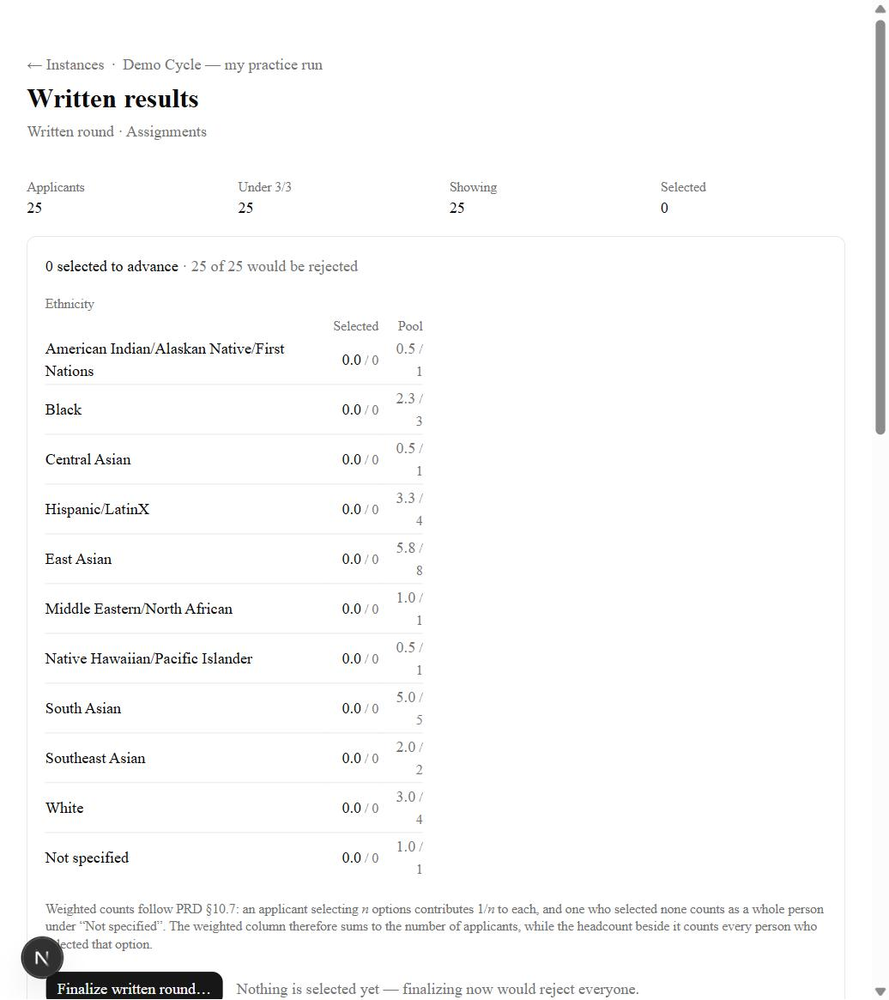

The table ranks everyone by average score, with **variance** beside it — a high
variance means reviewers disagreed, which is worth a second look before you cut
someone. **Reviews** shows how many of the three are in; anyone under 3/3 is
marked.

Tick the applicants who advance. As you do, the **composition panel** at the top
updates live: your selection against the whole pool, broken down by ethnicity.

> **It is there to be looked at while you choose, not audited afterwards.** The
> weighted column follows the club's counting rule — someone who selected three
> options contributes a third to each, so the column sums to the number of
> people rather than the number of boxes ticked. The headcount beside it counts
> every person who selected that option.

### Finalising

**Finalize written round** shows you exactly what is about to happen, and it
checks your work:

> *8 applicants advance to the first round. 17 applicants are rejected. Every
> applicant gets a written-round decision recorded, either way. This screen
> becomes read-only afterwards.*

If you are about to reject anyone nobody actually reviewed, it names them:

> *17 of those 17 have no completed reviews… **Rejecting them records a decision
> nobody made.** Claim-from-pool is how they still get read.*

**Take that seriously.** In a real cycle it means reviewing is not finished —
chase the outstanding reviews, or have someone claim those applicants from the
pool, before you finalise. The tool will let you proceed, because sometimes you
genuinely are out of time, but it will not let you do it without knowing.

Finalising writes a decision for **every** applicant, advancing or rejecting, and
the screen becomes read-only.

---

> ## About the screenshots from here on
>
> Steps 1–8 above were photographed while importing the 25-applicant training
> file, so what you see is what you get.
>
> **Steps 9–13 are photographed from the finished reference cycle instead**, at
> full size: 158 applicants, 30 reviewers, 7 new Sparklets. Getting a practice
> cycle this far by hand would mean twelve people signing in to vote and two
> interview spreadsheets to build, which is not a reasonable thing to ask of
> someone learning the tool — so the reference cycle exists already finished.
>
> **Your numbers will be much smaller than the ones in these pictures.** A
> first-round list of 8 rather than 48 is not a sign you have done something
> wrong. The screens are the same; only the scale differs.

---

## 9. Set up the interview rubric

**Interview rubric.**

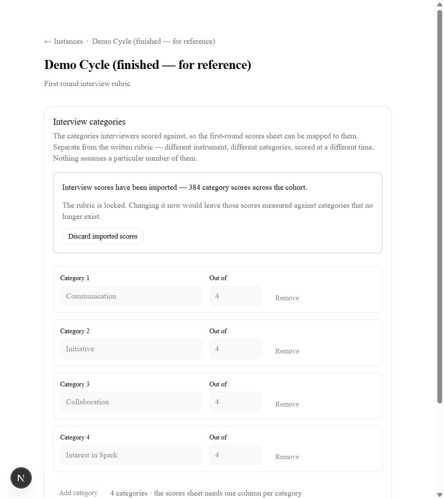

Interviews are scored on their own categories, separate from the written rubric —
a different instrument, scored at a different time by different people. Nothing
assumes a particular number of them.

**Do this before the interviews happen**, because the scores spreadsheet needs
**one column per category**, and the people running interviews need to know what
they are scoring against.

Once scores are imported the rubric locks, and the screen says so:

> *Interview scores have been imported — 384 category scores across the cohort.
> The rubric is locked. Changing it now would leave those scores measured against
> categories that no longer exist.*

If you genuinely got the categories wrong, **Discard imported scores** unlocks it
and you import again.

---

## 10. Import the interview results

**Interview import.**

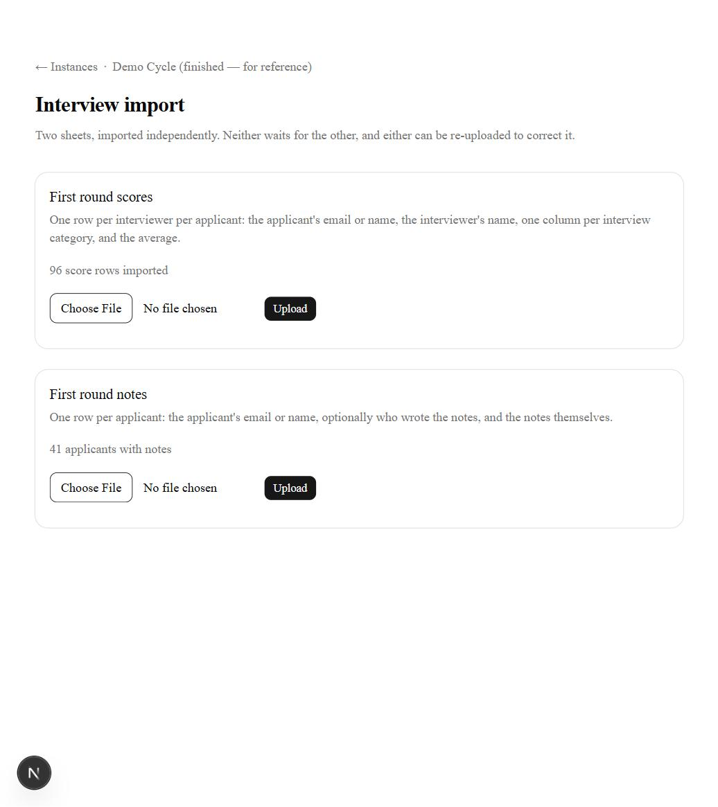

Two separate sheets, uploaded independently — neither waits for the other, and
either can be re-uploaded to correct it.

- **First round scores** — one row per interviewer per applicant: who they are,
  who interviewed them, one column per interview category, and the average.
- **First round notes** — one row per applicant: who they are, optionally who
  wrote the notes, and the notes themselves.

### Matching people up

This is the step most likely to need your attention, and the one the tool is
most careful about. Each row is matched to an applicant by **email first**, then
by exact name, then by close name. Anything it cannot resolve confidently goes
into a queue for you to decide, rather than being guessed.

> **It will not guess between two plausible people.** If a row could be either of
> two applicants, it asks. If a name is close to exactly one applicant, it still
> asks before committing — a nickname is often less similar to someone's real
> name than two different people's names are to each other, so "close enough" is
> not a decision the tool is willing to make on its own.

Fix the unresolved rows before moving on. A row left unmatched is an interview
that happened and does not count.

---

## 11. The first-round vote and its results

Reviewers on the first round read the interview scores and notes and vote yes or
no on each applicant. **First round results** ranks the outcome.

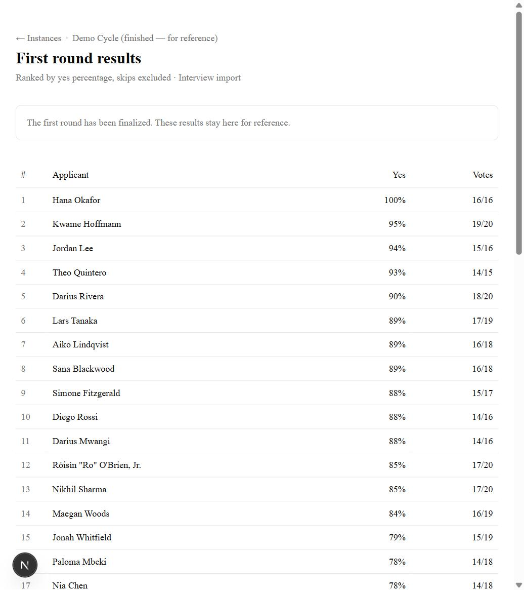

Ranked by **yes percentage, skips excluded** — someone who recused themselves is
not counted in either the top or the bottom of that fraction, so a recusal does
not quietly drag an applicant down. The **Votes** column shows the actual
fraction, which is what tells you whether a percentage is meaningful: 100% of 16
votes and 100% of 2 votes are not the same fact.

Select who advances and finalise, exactly as in step 8. Afterwards the page
stays as a read-only record:

> *The first round has been finalized. These results stay here for reference.*

---

## 12. The second round: passes

**Second round.**

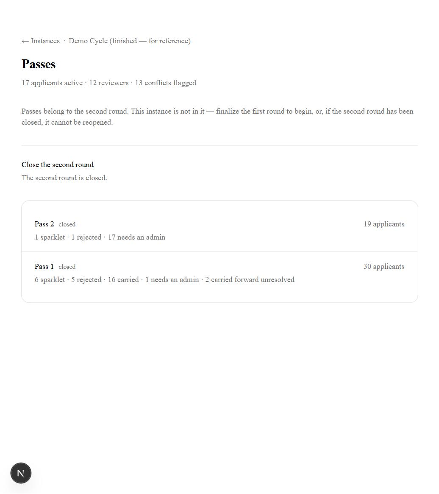

The second round is deliberation rather than scoring. Everyone still active is
discussed and voted on together, in one or more **passes**.

**Membership is fixed when the pass is created** — whoever is still active at
that moment. Each applicant in a pass resolves one of three ways:

| Outcome | Meaning |
|---|---|
| **Unanimous yes** | becomes a Sparklet |
| **Unanimous no** | rejected |
| **Anything mixed** | carried forward into the next pass |

That is why there is more than one pass: the summary above reads *"6 sparklet · 5
rejected · 16 carried"* on pass 1, and pass 2 opens with those carried applicants
plus anyone still unresolved.

### Conflicts of interest

A reviewer flags a conflict on an applicant and stops voting on them for the rest
of the round — the flag is sticky across every pass, not just the current one.
Their absence counts as a skip, not as a no.

**If every reviewer has recused from someone, that is not unanimity.** The tool
marks them as needing an admin rather than reading an empty tally as a decision.

### Rejecting someone by hand, and undoing it

Below the grid, **Reject an applicant** removes someone from this and every later
pass without a vote — use it when the room has decided and waiting for eleven
submissions is theatre. It asks you to confirm, and names the person with their
applicant number, because names repeat.

If you rejected the wrong person, **Reverse a rejection** on the same page puts
them back, **as long as the pass is still open** — once it closes, nothing in it
can be changed. Only a rejection you made by hand can be reversed; one decided
by a unanimous no cannot. Both actions are recorded in Activity with your name.

### Closing

Closing the second round marks everyone still undecided as needing an admin, and
**cannot be reopened**. You resolve those yourself on the next screen.

---

## 13. The final class, and the export

**Final class.**

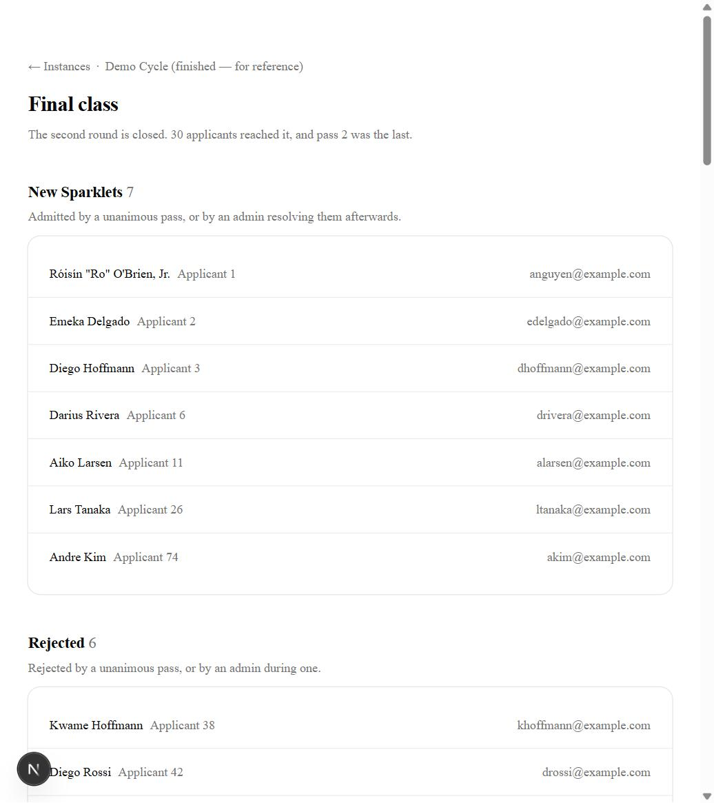

Three groups: **New Sparklets**, **Rejected**, and **Unresolved** — the people
the passes never decided, either because reviewers never reached unanimity or
because everyone had recused.

Unresolved applicants are admitted or rejected **here, on this screen**, and
their votes stay visible while you decide. That matters: eleven skips and a 7–4
split both arrive as "unresolved", and they mean completely different things.

Below the three groups is the **demographic breakdown of the class against each
preceding stage** — who applied, who reached the first round, who reached the
second, and who got in. This is the number the club actually wants at the end of
a cycle, and it replaces the spreadsheet that used to be maintained by hand.

### Export, and please actually do it

**Export** gives you the whole cycle as one JSON file, plus per-stage CSVs
(all applicants with scores, decisions by stage, the final class with emails).

> **Do this at the end of every cycle and put the file somewhere the club keeps
> things.** It is the club's insurance against this tool: everything is in that
> file, in a format anything can read, so nobody is ever locked in. It is also
> what you would restore from if something went badly wrong.

The JSON contains the instance password hash and the round access codes, so treat
it like the sensitive file it is.

---

## When a cycle is over

Nothing else is required. The cycle stays where it is, readable, for as long as
the club wants it.

**Retention** on the instance list is where old cycles are eventually cleaned up:
the club keeps the most recent few in full, and older ones can have their essays,
emails and demographic answers deleted while the statistics are kept. That is a
deliberate, confirmed action — nothing is ever deleted automatically. Export
first.
