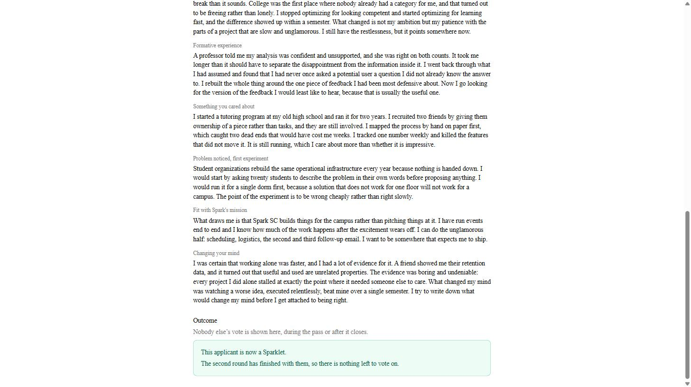

# Reviewing for Spark SC

You have been asked to read applications. This takes a couple of minutes to
learn and works on your phone.

You need two things, both in the message that sent you here: **a link** and **an
access code**. The link alone will not get you in.

---

## Getting in

Open the link. Pick the round you were asked to help with, choose your name from
the list, type the code, and press **Start reviewing**.

**If your name is not in the list**, you have not been added to that round yet —
or you are on a different round. Check the round buttons at the top first, then
message whoever sent you the link. It is not something you can fix from here.

You stay signed in for a day, so you can put your phone down and come back.

---

## Your list

These are yours. The counter at the top says how many you have finished.

**You will not see anyone's name.** Applicants are "Applicant 11", "Applicant
14", and so on — not their name, not their email, and never their background.
That is on purpose, and it is not something anyone can switch off for you.

Beyond that, what you see is what your admin chose to show: the written answers
always, and sometimes a detail like the major or graduation year. If a field is
not there, it is because it was deliberately kept back.

If you can see the graduation date, you may see **Class standing** just under it
— Senior, Junior, Sophomore or Freshman, worked out for you. Two other words can
appear there. **Unknown** means the applicant left the question blank.
**Non-standard** means the answer does not fit a normal undergraduate timeline, or
was not written as a plain term like "Fall 2027" — read the graduation date above
it for yourself. Neither is a mark against anyone.

Tap one to open it.

---

## Scoring

You get their written answers, then the scoring boxes underneath.

**Tap a number for each category.** Above the buttons is a line for *every score
the category offers* — what a 1 looks like, what a 2 looks like, and so on. Read
them the first time. They are the difference between thirty people scoring the
same thing and thirty people scoring thirty things, and the boundary between a 2
and a 3 is where reviewers most often quietly disagree.

> If a category shows only its name and buttons, nobody wrote the guidance. Score
> it as you read it and say so in your note.

**Your scores save as you tap.** There is no submit button and nothing to lose if
your phone dies or you close the tab. The score turns dark and the word *Saved*
appears next to it.

Leave a **note** if there is something the number does not capture. Optional, but
it is what gets read when two reviewers disagree about someone.

### If the writing looks AI-generated

At the bottom of the card there is one button: **This looks AI-written to me.**

Press it if that is your honest read. It fills in dark to show it is on, the same
way a score button does, and pressing it again turns it off.

It goes to the admin running recruitment with your name on it, no other reviewer
sees it, and **nothing is decided by it on its own** — three reviewers
disagreeing about one application is exactly the signal it exists to surface.
Nothing in the tool detects anything; this is your judgement, recorded, and it is
a reason for someone to read the application again rather than a verdict.

Leave it alone if you are unsure. A button you never pressed says nothing about you.

Then go back and pick the next one. You do not have to do them all at once.

---

## If you know the applicant

Press **Return to pool** on your list, and say why.

Do this. It is not a failure to review — a friend, a roommate, someone from your
class, or anyone you would find it hard to be fair about. The applicant goes back
into a shared pool for a different reviewer to pick up, and the fact that you
recused is recorded rather than the applicant quietly getting one fewer opinion.

**Claim from pool**, at the top of your list, is the other side of this: if there
are applicants sitting in the pool and you have time, you can take one on.

---

## The first round

Same link, pick **First round**, use that round's code. What you do is
different: you get **interview scores and notes** on top of the application, and
instead of numbers you give **one vote, yes or no**.

Names are visible from here on. The written round hid them; the first and second
rounds do not.

**The list is for finding people, not for voting.** Every row shows the name, the
applicant's number, and how much interview data has arrived. **Tap a name to
open them** — the vote is on their page and nowhere else.

That changed deliberately. The row never showed the interview scores themselves,
only whether they existed, so a vote cast from the list was a vote cast on a name
and a count. You now see the evidence before you can register an opinion about
it.

**Find by name or number**, in the box above the list. Useful more often than it
sounds: two applicants can share a name, which is why every row carries
"Applicant 61" beside it. Type a number to go straight to one.

The counter at the top says how many of the round you have voted on, and rows you
have already decided say **You voted yes** or **You voted no** underneath. That
is your own vote only — you never see anyone else's, in any round.

Their page gives you one score per interviewer, the per-category breakdown folded
underneath, the interviewer's notes, and the application they wrote. **Yes** and
**No** are at the bottom.

> **The written answers are here too.** They used to be hidden in this round, on
> the theory that the interview was what you were judging. They are not any more:
> if you want to check what someone wrote against how they interviewed, you can.

**A vote saves the moment you tap it**, and you can change it any time until the
round is finalised — tap the other button. There is no way to take a vote back
to blank, so if you want to abstain, do not vote.

**If you know the applicant, leave the vote blank.** There is no "return to
pool" here. A blank counts as a skip and does not count against them.

---

## The second round

The second round is a room, not a queue: everyone still in is discussed
together, in one or more **passes** that an admin opens. Until a pass is open the
list is there to read — the line under the heading tells you which.

**Everyone who reached this round stays on your list for the whole of it**, and
the ones the round has finished with say so: a green **Sparklet** or a red
**Rejected** beside the name. The heading counts both — *"30 applicants in the
round · 20 still to decide"* — so you can see what is left without counting.

> **Why you can see the outcome but never the votes.** A decided applicant is a
> settled fact that gets said out loud in the room anyway, and a list that
> silently dropped people left you unable to tell whether the person you had just
> spent ten minutes arguing about got in. What you still never see is *how anyone
> voted* — no tallies, no names against a yes or a no, in any pass, open or
> closed.

Tap a name for the full profile: the interview scores and notes, every written
review with the reviewer's name on it, and the application itself.

> **You will not see anyone's ethnicity or background here**, and neither did the
> earlier rounds. Those answers exist — the club reports on them — but they are
> an admin figure, not something a deliberation is conducted over.

**Voting takes two taps.** At the bottom, tap **Yes** or **No**, then **Submit
vote** — nothing is recorded until you submit. You can change it with the same
two taps until the pass finishes with that applicant. You never see anyone
else's vote, during the pass or after it closes.

Unanimous yes makes them a Sparklet, unanimous no rejects them, and anything
mixed carries them into the next pass.

**Once a pass has finished with someone, their page says so and the buttons are
gone.** A decided applicant reads *"This applicant is now a Sparklet"* or *"This
applicant was rejected"*; one the pass carried forward says only that it has
finished with them for now, without saying which way anything went, because
nothing went either way yet.

**If you know the applicant, flag a conflict of interest** — from the row on
your list, or from the bottom of their profile. You are recorded as skipping
them, which does not count against them. Two things to know before you tap it:
it deletes any vote you have already cast on them, and it sticks for the whole
round, every pass. Only an admin can undo it, so you are never asked twice.

You will not find that control on someone already decided. There is nothing left
for a conflict to bear on, so it is not offered rather than offered and refused.

---

## Common questions

**Can I change a score after I set it?** Yes. Tap a different number.

**Why can't I vote from the first-round list any more?** Because the row only
ever showed whether interview scores existed, not what they were. Open the
applicant and the vote is at the bottom of their page.

**I ticked "this looks AI-written" — what happens?** It reaches the admin
running recruitment, with your name. No other reviewer sees it, and nothing is
decided by it alone. Press it again if you change your mind.

**I closed the tab halfway through — did I lose it?** No. Everything saved as you
tapped.

**Someone else's name is showing in the corner.** You are signed in as them,
probably on a shared device. Sign out, top right, and sign in as yourself. Do not
score anything first — it would be recorded against them.

**How many should I do?** Whatever you were asked for. The counter at the top of
your list tells you where you are.
