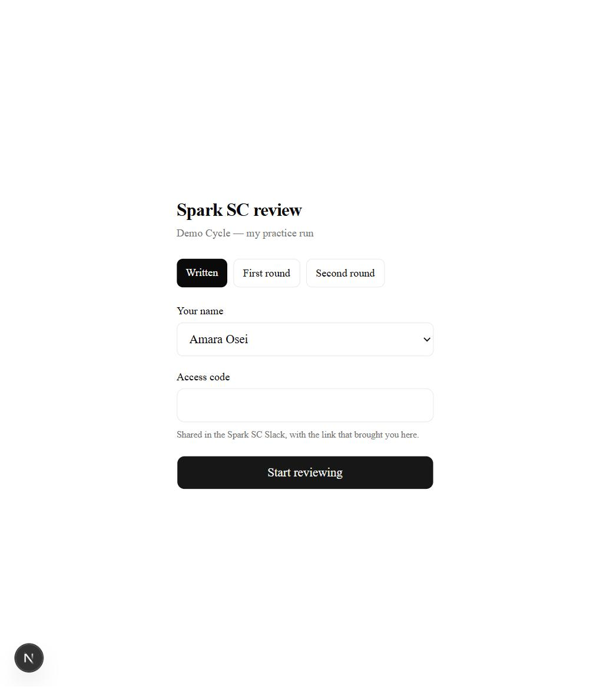
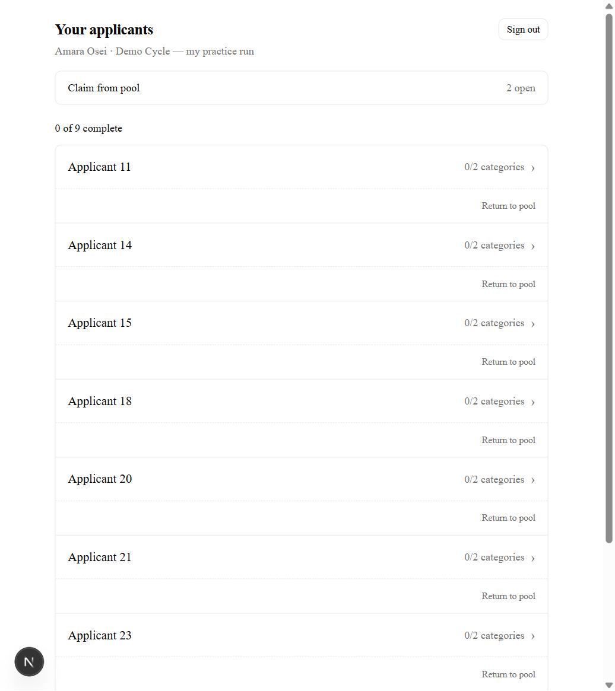
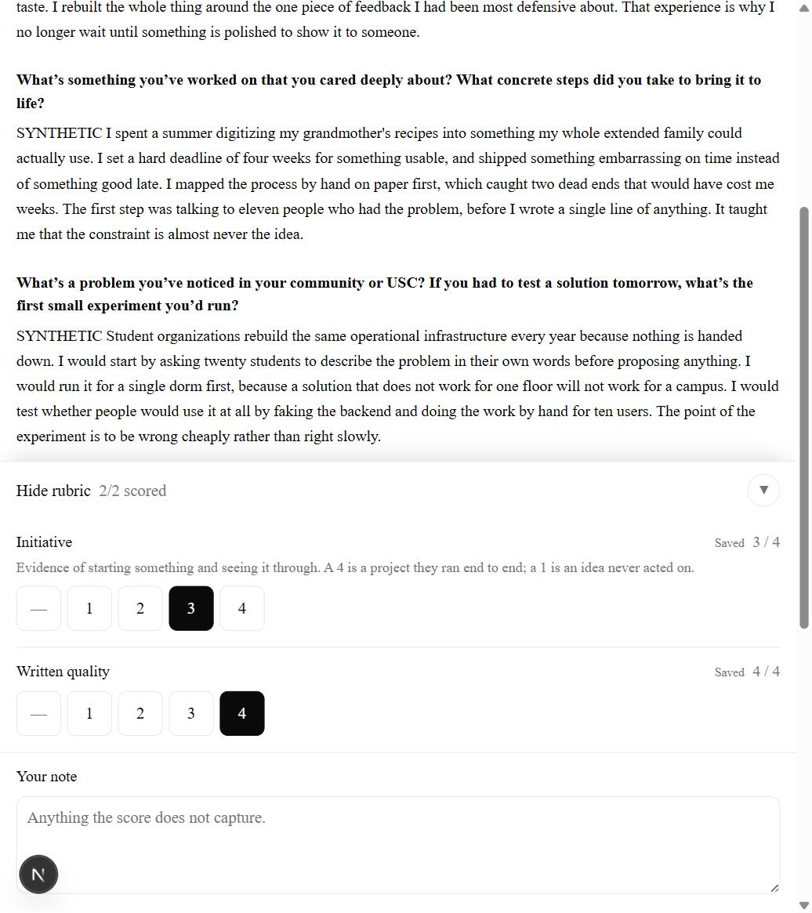
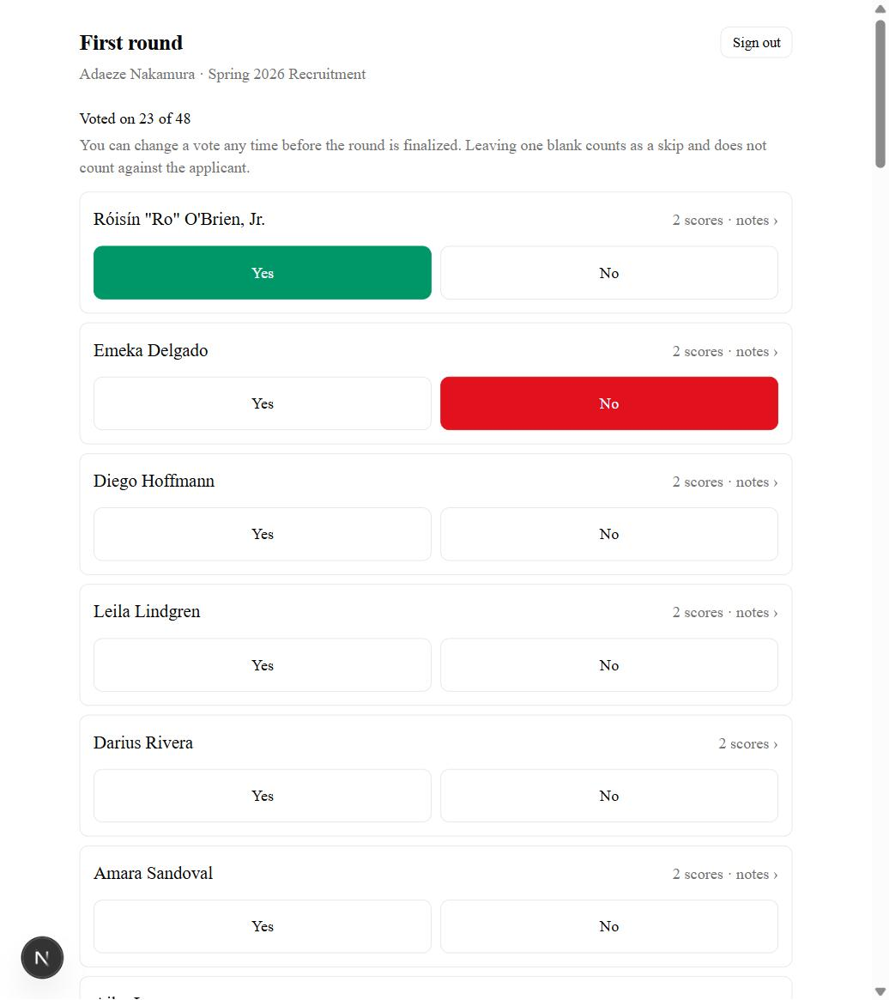
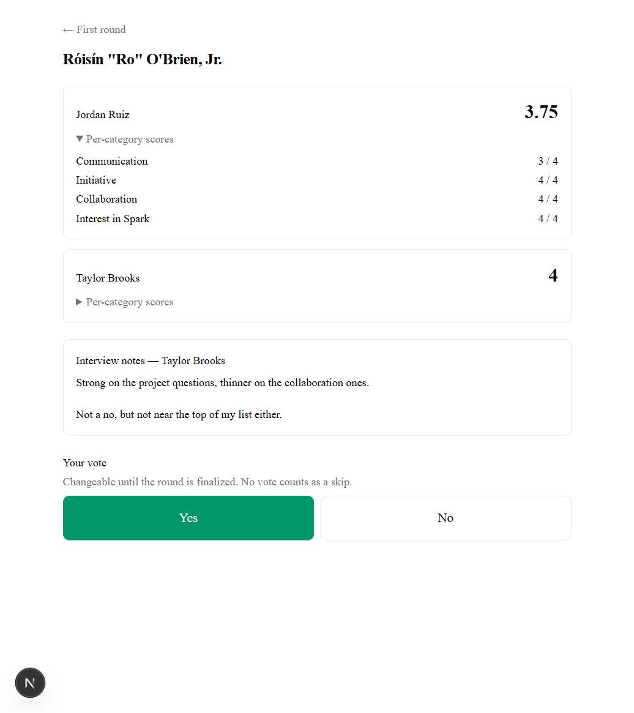
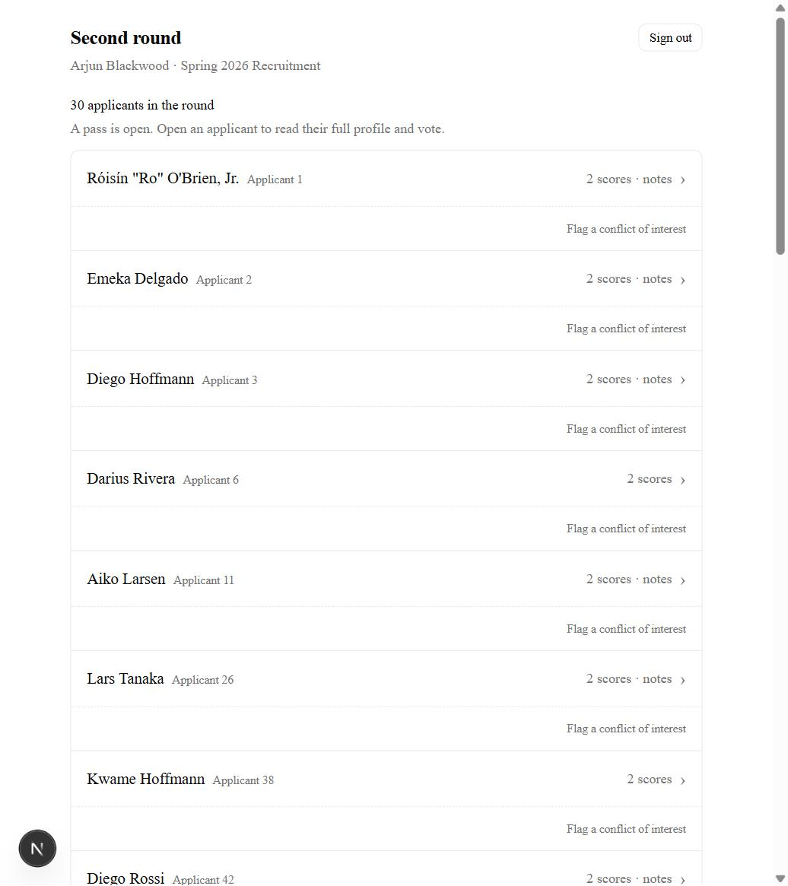
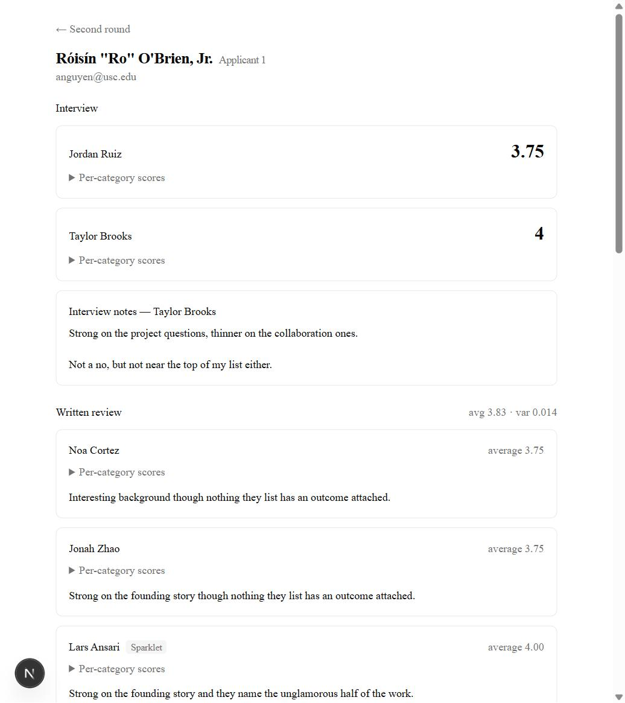
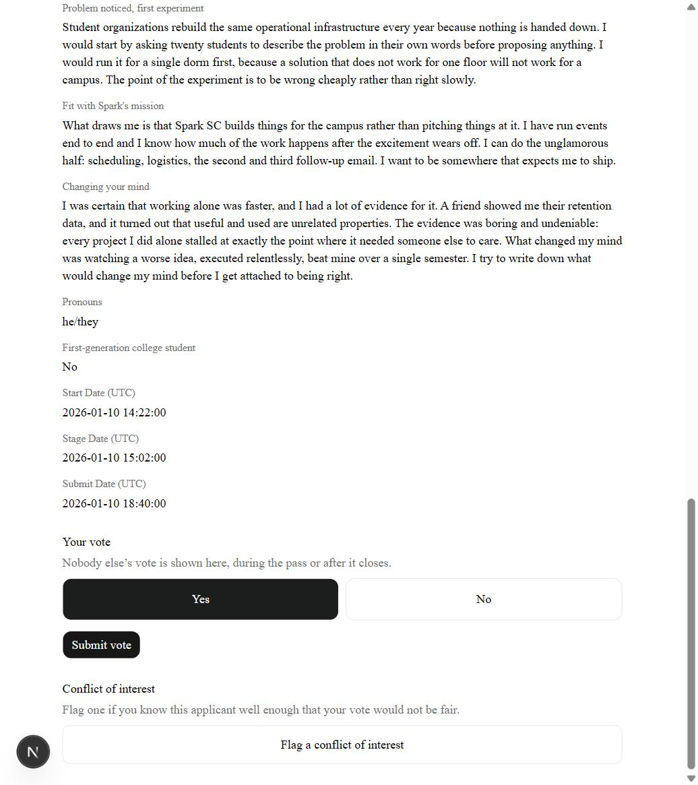

# Reviewing for Spark SC

You have been asked to read applications. This takes a couple of minutes to
learn and works on your phone.

You need two things, both in the message that sent you here: **a link** and **an
access code**. The link alone will not get you in.

---

## Getting in

Open the link. Pick the round you were asked to help with, choose your name from
the list, type the code, and press **Start reviewing**.

**If your name is not in the list**, you have not been added to that round yet —
or you are on a different round. Check the round buttons at the top first, then
message whoever sent you the link. It is not something you can fix from here.

You stay signed in for a day, so you can put your phone down and come back.

---

## Your list

These are yours. The counter at the top says how many you have finished.

**You will not see anyone's name.** Applicants are "Applicant 11", "Applicant
14", and so on. You see what they wrote and nothing else — not their name, not
their email, not their year, not their background. That is on purpose, and it is
not something anyone can switch off for you.

Tap one to open it.

---

## Scoring

You get their written answers, then the scoring boxes underneath.

**Tap a number for each category.** Beside each one is a line explaining what
that category means and what a high or low score looks like — read it the first
time, it is what keeps thirty people scoring the same thing.

**Your scores save as you tap.** There is no submit button and nothing to lose if
your phone dies or you close the tab. The score turns dark and the word *Saved*
appears next to it.

Leave a **note** if there is something the number does not capture. Optional, but
it is what gets read when two reviewers disagree about someone.

Then go back and pick the next one. You do not have to do them all at once.

---

## If you know the applicant

Press **Return to pool** on your list, and say why.

Do this. It is not a failure to review — a friend, a roommate, someone from your
class, or anyone you would find it hard to be fair about. The applicant goes back
into a shared pool for a different reviewer to pick up, and the fact that you
recused is recorded rather than the applicant quietly getting one fewer opinion.

**Claim from pool**, at the top of your list, is the other side of this: if there
are applicants sitting in the pool and you have time, you can take one on.

---

## The first round

Same link, pick **First round**, use that round's code. What you do is
different: instead of essays you get **interview scores and notes**, and instead
of numbers you give **one vote, yes or no**.

Names are visible from here on. The written round hid them; the first and second
rounds do not.

Every row on the list carries the vote — tap **Yes** or **No** right there. The
counter at the top says how many you have voted on. Tap a name to see the
interview in full: one score per interviewer, the per-category breakdown folded
underneath, and the interviewer's notes. The same two buttons are at the bottom.

**A vote saves the moment you tap it**, and you can change it any time until the
round is finalised — tap the other button. There is no way to take a vote back
to blank, so if you want to abstain, do not vote.

**If you know the applicant, leave the vote blank.** There is no "return to
pool" here. A blank counts as a skip and does not count against them.

---

## The second round

The second round is a room, not a queue: everyone still in is discussed
together, in one or more **passes** that an admin opens. Until a pass is open the
list is there to read — the line under the heading tells you which.

Tap a name for the full profile: the interview scores and notes, every written
review with the reviewer's name on it, and the whole application, including the
answers the written round hid.

**Voting takes two taps.** At the bottom, tap **Yes** or **No**, then **Submit
vote** — nothing is recorded until you submit. You can change it with the same
two taps until the pass finishes with that applicant. You never see anyone
else's vote, during the pass or after it closes.

Unanimous yes makes them a Sparklet, unanimous no rejects them, and anything
mixed carries them into the next pass.

**If you know the applicant, flag a conflict of interest** — from the row on
your list, or from the bottom of their profile. You are recorded as skipping
them, which does not count against them. Two things to know before you tap it:
it deletes any vote you have already cast on them, and it sticks for the whole
round, every pass. Only an admin can undo it, so you are never asked twice.

---

## Common questions

**Can I change a score after I set it?** Yes. Tap a different number.

**I closed the tab halfway through — did I lose it?** No. Everything saved as you
tapped.

**Someone else's name is showing in the corner.** You are signed in as them,
probably on a shared device. Sign out, top right, and sign in as yourself. Do not
score anything first — it would be recorded against them.

**How many should I do?** Whatever you were asked for. The counter at the top of
your list tells you where you are.
